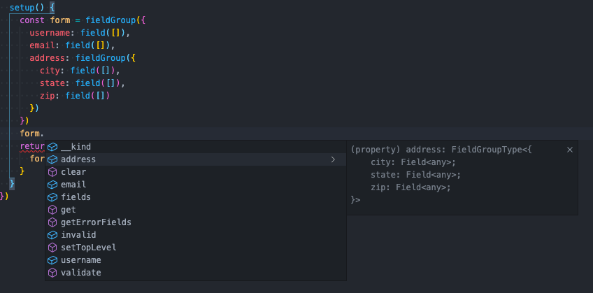
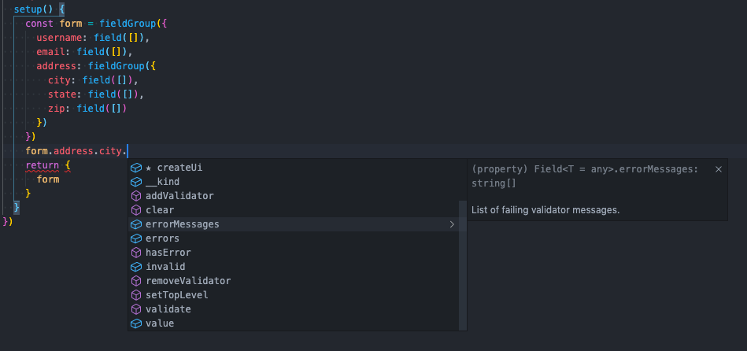

# TypeScript

Vue-Validus is written in TypeScript and provides typings, so you can benefit from your editor's IntelliSense features when working with this library.

This may prove especially useful for working with fields and field groups by providing visibility into all field members, properties, and functions available while you code.

**Example**

Depending on the capabilities of your editor, you may see intelligent code completion and signature information like below.  *(Screenshots are from Visual Studio Code)*

